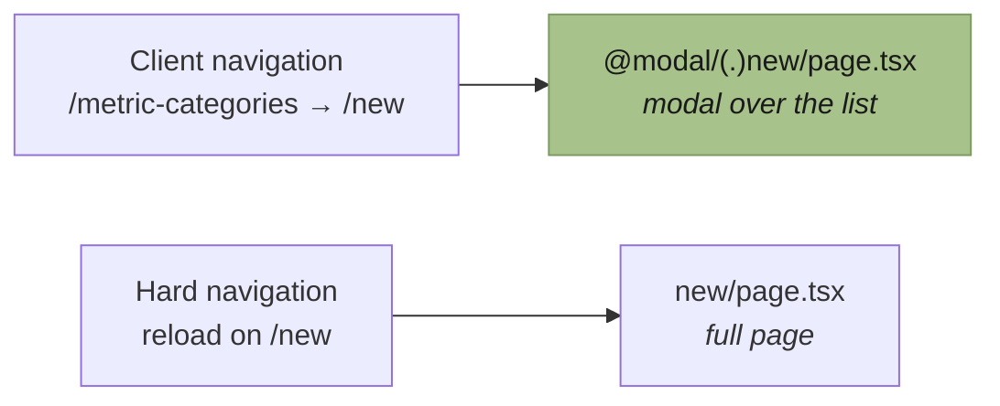

# App Router and `@modal` routing

Why dialogs in this app are URLs, and what that costs.

## Route groups

`(app)` and `(auth)` are organisational only — the parentheses keep them out of the URL. They exist
so the two shells can differ: `(app)` renders the sidebar and header, `(auth)` renders a bare
centred card.

## The idea behind intercepted routes

A dialog that is also a real URL. Opening "New category" from the list shows a modal over it; the
address bar reads `/metric-categories/new`. Reload, and the same route renders as a full page.

That buys three things a component-state dialog cannot:

- The dialog is linkable and shareable.
- Back and forward work — closing is a `router.back()`, not a state flip.
- Server rendering, so the form's initial data is fetched on the server.

## How it is wired



The same route exists twice: once as a normal segment, once inside `@modal/` with an interception
matcher. Next picks based on how you arrived.

Matchers: `(.)` same level, `(..)` one up, `(...)` from root.

## The two invariants

Both fail loudly, and both have already broken this app once:

1. **Every layout in a tree containing an `@modal` slot must render `{modal}` alongside
   `{children}`** — including layouts above the one that owns the slot. Omit it and Next throws
   `Invalid interception route`.
2. **Every `@modal` directory needs a `default.tsx`.** It renders when the slot has no match, which
   is what happens on a hard navigation. Without it the slot cannot resolve.

Postmortem:
[`../../internal/incidents/fix-metric-modal-routing-20251130.md`](../../internal/incidents/fix-metric-modal-routing-20251130.md).

## The cost

The slot must be threaded through every layout in the subtree, and nested trees each need their own
`@modal` directory with its own `default.tsx`. The metrics tree has four:

```
metrics/@modal/
metrics/[metricId]/@modal/
metrics/[metricId]/logs/@modal/
metrics/[metricId]/settings/@modal/
```

That is the price of dialogs being addressable. It is paid once per subtree and is worth it here
because most dialogs in this app are create/edit forms that benefit from being linkable — but it is
not free, and a dialog that will never be linked does not need this machinery.

## `params` and `searchParams` are promises

Next 16 made both async. Await them:

```tsx
const { categoryId } = await params;
const { q } = await searchParams;
```

Reading them synchronously is the subject of
[`../../internal/incidents/fix-searchParams-and-cookies-20251130.md`](../../internal/incidents/fix-searchParams-and-cookies-20251130.md).
`cookies()` is async for the same reason.

## Related

- [`../../reference/routes-and-proxy.md`](../../reference/routes-and-proxy.md)
- [`../../how-to/development/add-a-route.md`](../../how-to/development/add-a-route.md)
