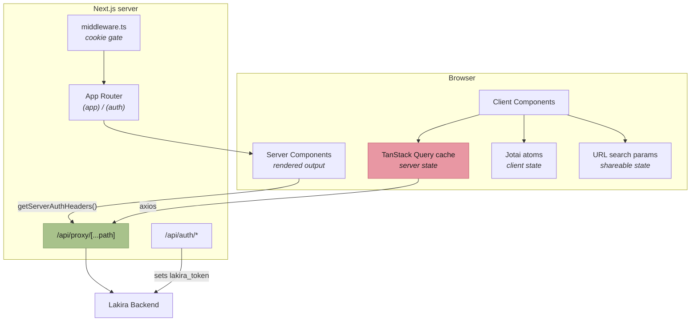

# Containers

What runs inside the frontend, and where each kind of state lives.

## Three kinds of state, three homes

Putting state in the wrong one is the most common architectural mistake here.

| Kind                                                          | Lives in          | Example                            |
| ------------------------------------------------------------- | ----------------- | ---------------------------------- |
| **Server state** — owned by the backend, cached locally       | TanStack Query    | The metric list, a category record |
| **Client state** — ephemeral, session-scoped                  | Jotai atoms       | Sidebar open, theme preference     |
| **Shareable state** — must survive a reload and a copied link | URL search params | Search text, sort order, page      |

The test is simple: _if the user reloads, or sends someone this URL, should the state come back?_
If yes, it belongs in the URL, not a Jotai atom. List search, sort, and pagination all follow this —
see `listSearchParams.ts` in any feature and the `useRouteSync` hook.

Server state never belongs in Jotai. Duplicating it there produces two sources of truth that drift,
and the drift is silent.

## Two ways in

- **`middleware.ts`** cookie-gates `/dashboard`, `/metrics`, `/metric-categories`, `/account` and
  redirects to `/login?returnUrl=…`. It runs before any page code.
- **The proxy** enforces auth again on the first path segment of API calls. Belt and braces: the
  middleware protects pages, the proxy protects data.

## The SSR trap

A server component's fetch does **not** carry the browser's cookies automatically. It must forward
them via `getServerAuthHeaders()` (`src/services/api/serverHeaders.ts`).

Forget it and the request returns 401, which renders as an empty page rather than an error. Two of
the four logged incidents are this bug.
