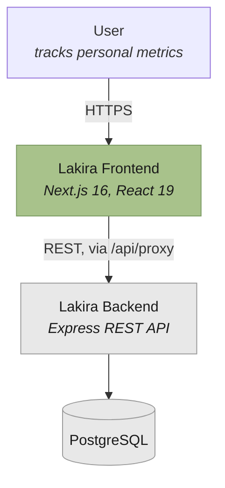

# System context

What the frontend talks to, and what it deliberately does not.

## The one rule this diagram encodes

**The browser never talks to the backend directly.** Every call goes through the frontend's own
`/api/proxy/[...path]` route handler.

That exists so the session token can live in an httpOnly cookie. The proxy reads the cookie
server-side and attaches `Authorization: Bearer <token>` before forwarding. Client JavaScript never
sees the token, so an XSS bug cannot exfiltrate it.

The cost is a hop: every request is served by the Next server before reaching Express. That is
accepted deliberately — see [`data-access-and-caching.md`](./data-access-and-caching.md).

## What the frontend owns

- Rendering, routing, and client state.
- Session cookie lifecycle (`/api/auth/login`, `/logout`, `/session`).
- Security headers and CSP (`next.config.ts`), with violations reported to
  `/api/security/csp-report`.

## What the backend owns

- All persistence. The frontend has no database.
- All authorization decisions. The proxy's allowlist is defence in depth, not the authority.
- The API contract, published as OpenAPI and snapshotted into
  [`../../reference/api/`](../../reference/api/).
