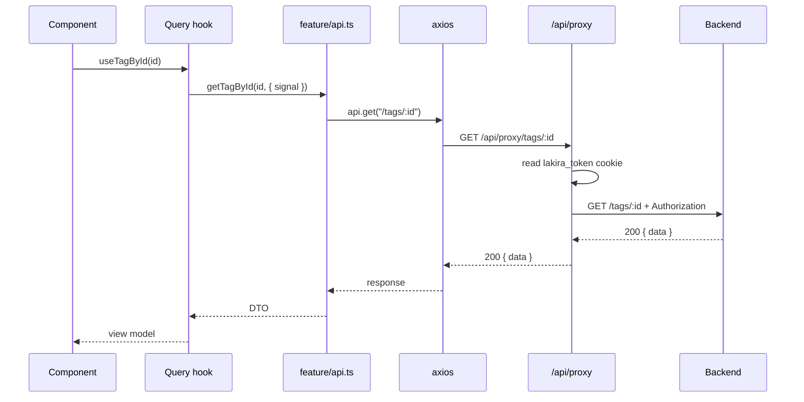

# Data access and caching

Every request takes the same path, and the cache is keyed so that invalidation can be reasoned
about. Both of those are load-bearing: three of the four logged incidents are failures of one or the
other.

## The path



No layer may be skipped. A component calling axios directly bypasses error normalization, request
cancellation, and the retry policy at once.

## Why the proxy hop is worth it

It exists so the session token can be httpOnly. That is the whole argument: an XSS bug cannot steal
a cookie JavaScript cannot read.

The costs are real — one extra network hop, and server-rendered fetches must forward cookies
explicitly via `getServerAuthHeaders()`. The second cost is where the bugs come from: a forgotten
forward returns 401, which renders as an empty page rather than an error.

## Error normalization

`withApiErrorHandling` converts any failure into a `NormalizedApiError`:

```
{ isAbort, status, code, title, messages[], retryable, raw }
```

Components branch on that shape, never on axios internals. **Check `isAbort` first** — an aborted
request is not a failure, and treating it as one paints an error onto a form the user has already
left.

## Cache keys

Keys are built in the feature's `keys.ts` and nest so a prefix can be invalidated:

```
["tags"]                          → everything
["tags", "list"]                  → all lists
["tags", "detail"]                → all details
["tags", "detail", "abc"]         → one record
```

**Parameters must be normalized before they enter a key.** Trim strings, default optionals, collapse
empties to `undefined`. Otherwise `{ q: "" }` and `{}` are different keys holding the same result,
and invalidating one leaves the other serving stale data. `metric-categories/keys.ts` has a
`normalizeCursor` helper that does exactly this.

## Invalidation lives in `cache.ts`

A mutation calls a helper from the feature's `cache.ts` rather than invalidating inline. The reason
is discoverability: the set of things a write affects is declared in one file, so the next person
adding a query knows what must invalidate it.

Inline invalidation is how a mutation ends up refreshing the list but not the detail — the exact
shape of `fix-metric-detail-cache-stale-20251130.md`.

## Related

- [`../../reference/routes-and-proxy.md`](../../reference/routes-and-proxy.md)
- [`../../internal/incidents/`](../../internal/incidents/)
- [`../../../.claude/rules/data-access.md`](../../../.claude/rules/data-access.md)
