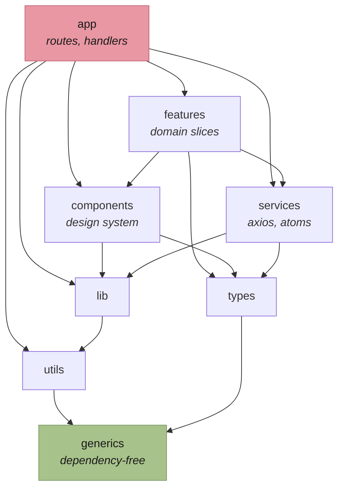

# Layers and boundaries

The import graph is enforced, not merely documented. `eslint-plugin-boundaries` in
`eslint.config.mjs` fails the build on a violation.



Arrows point _may import_. The graph is acyclic, and `generics` is the sink — it depends on nothing,
which is what makes it safe to import from anywhere.

## Why this shape

The direction encodes stability. A layer may only depend on something more stable than itself.
`app` changes every time a route is added; `generics` changes almost never. Inverting an arrow would
let a rendering concern force a change in a pure utility.

## Two rules that surprise people

- **A feature may not import another feature.** Domains stay independently movable. The only legal
  cross-feature surface is `src/features/shared/`, which holds exactly three things:
  `buildQueryString`, `buildCursorQueryString`, and `CursorListParams`.
- **`app → types` is not allowed.** Route files reach DTOs through the feature that owns them, so
  that a route never binds directly to the wire format.

## The quarantine

`src/components/**` was unmapped in `boundaries/elements` until 2026-08-17, so the `components`
boundary never ran and 18 inversions accumulated. The rule is live now, with two files exempted at
the bottom of `eslint.config.mjs`:

```
Header.tsx · Sidebar.tsx
```

The list has only ever shrunk, and the two ways off it are both visible in its history.
`CategorySelect.tsx` and `Visualization.tsx` left on 2026-09-11 by being **moved** into the feature
modules they were reaching into. `withAuth.tsx` and `HydrateUser.tsx` left on 2026-09-22 by being
**deleted** — `HydrateUser` was referenced nowhere, and `withAuth` guarded a single route that
`src/proxy.ts` and `(app)/layout.tsx` already gate, while duplicating a profile fetch the page was
making anyway. An inversion that exists only to serve dead code is removed, not inverted.

They import from `features`, which the graph forbids. **Do not add to that list.** It is a debt
register, not an escape hatch — each entry is a component that should be inverted so the feature
passes data in rather than the component reaching out.
